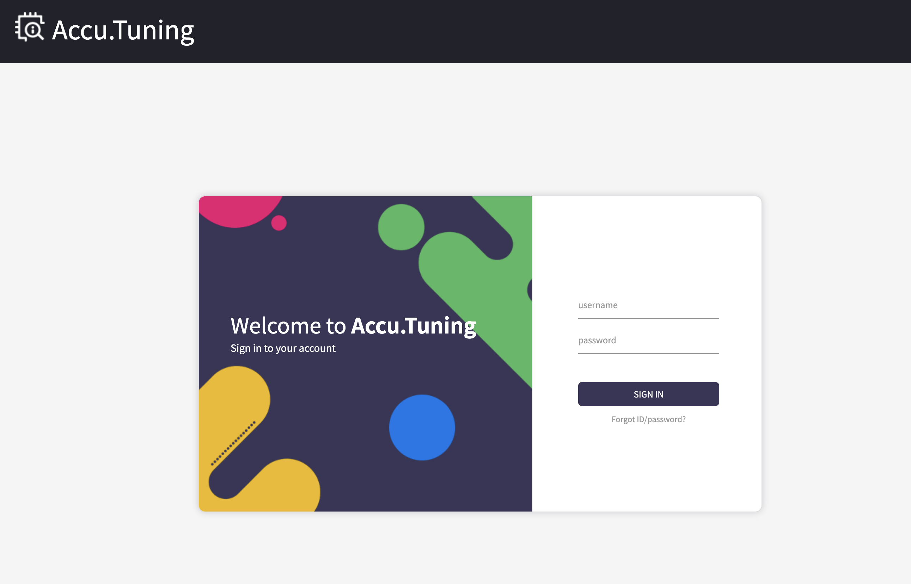

# AWS Marketplace를 이용한 설치가이드 
-----
AWS Marketplace 상에 등록되어 있는 Accu.Tuning 이미지를 활용하여 복잡한 설정 필요 없이도 간단하게 Amazon EC2 인스턴스를 구성하여 사용할 수 있습니다. 사용 방법은 아래와 같습니다. (21' 4월 기준)

**AWS Marketplace 내 AccuTuning 검색 결과**

**AWS Marketplace 내 AccuTuning Overview**

## 사용 방법
#### 1. AWS 로그인 후 EC2 화면에 진입합니다.

#### 2. EC2 인스턴스 탭에서 우측 상단 인스턴스 시작 버튼을 클릭합니다.

#### 3. 좌측 AWS Marketplace를 선택하고 AccuTuning을 검색하여 선택 버튼을 클릭합니다.

#### 4. AccuTuning 개요를 확인하고, Continue 버튼을 눌러 계속 진행합니다.

#### 5. AWS EC2 설정을 진행합니다.
- 이미지 생성 시 인스턴스 유형은 t2.xlarge (4 cpu, 16GB) 이상으로, 넉넉한 공간 확보를 위하여 Storage는 100gb로 늘려줄 것을 권장합니다.

#### 6. SSH 접속 등이 필요한 경우 보안 그룹 설정에서 22번 포트를 추가하여 이용할 수 있습니다.

#### 7. 검토 및 시작 버튼을 누르면 키페어 선택 후 인스턴스를 시작할 수 있습니다.
- SSH 접속 등에 필요한 키페어를 생성하거나 기존 것을 활용하여 선택하여 진행합니다.

#### 8. 인스턴스 목록으로 돌아가 새 인스턴스 생성을 확인합니다. 접속 주소는 Public IPv4 주소 / DNS에서 확인 가능합니다. 
- 제공되는 주소의 8000 포트로 접속하면 AccuTuning 사용 화면에 접속할 수 있습니다.
- 스크린샷 예제의 경우 3.209.10.77:8000 혹은 http://ec2-3-209-10-77.compute-1.amazonaws.com:8000 로 접속할 수 있습니다.

#### 10. 접속 시 아래와 같이 로그인 창이  적절한 ID/PW를 입력합니다.
- ID는 **accutuning**, PW는 **인스턴스 ID**로 기본 설정 되어 있습니다.
- 기본 설정된 ID / PW를 입력하여 최초 로그인하면, PW 변경할 수 있도록 진행됩니다.

#### 11. 로그인에 성공하면, License key 입력을 진행 후에 Accu.Tuning 기능을 사용할 수 있습니다.
- [channel-install-guide.md](https://github.com/AIIP-DEV/accutuning-install/blob/main/channel-install-guide.md) (5번부터)를 참고하여 License key 등록을 진행할 수 있습니다.

#### 12. 사용 시 Accu.Tuning에 대한 비용은 청구되지 않으나, 인프라 사용에 의한 비용은 AWS 쪽에 부담해야 합니다.

