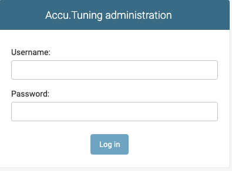
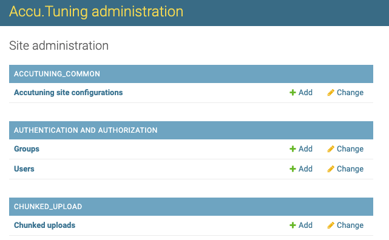
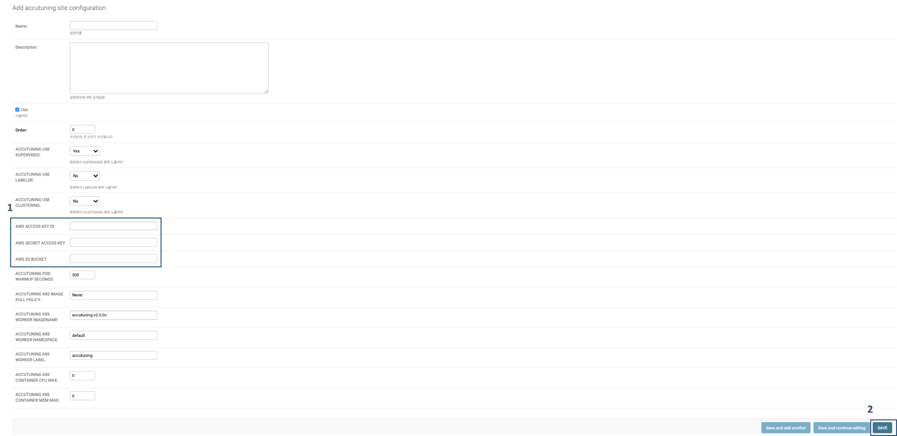
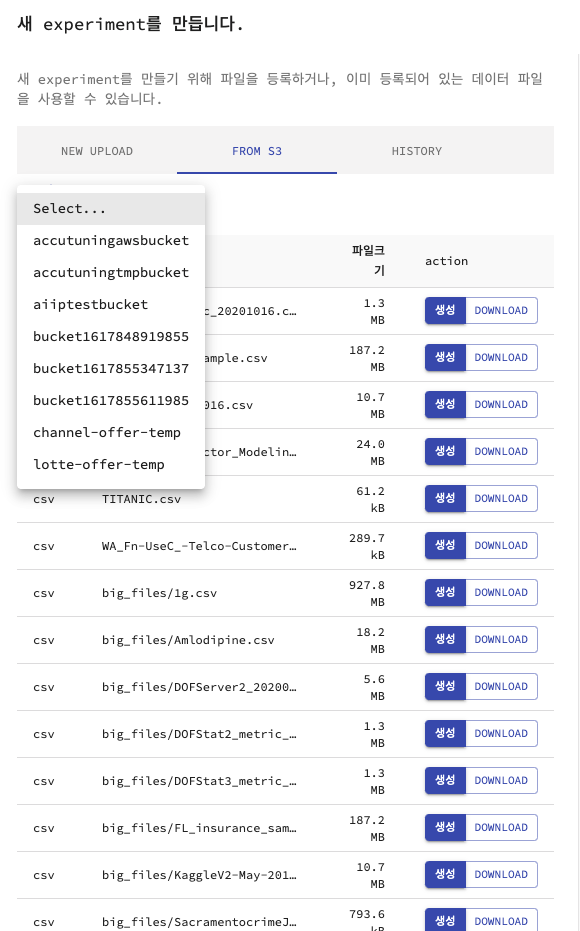

# AWS S3 연동을 위한 가이드 
-----
설치된 Accutuning에 S3를 연동하여 S3 버켓에 있는 데이터를 Accutuning을 통해 분석할 수 있도록 하는 가이드 문서입니다.

## 연동 방법
#### 1. <Accutuning IP주소>:8001/_admin으로 접속합니다.

#### 2. 제공받은 username / password로 로그인 합니다.

#### 3. ACCTUNING_COMMON -> Accutuning site configurations -> Add를 클릭합니다.

#### 4. AWS ACCESS KEY ID, AWS SECRET ACCESS KEY 필드에 AWS 계정 정보를 입력하고, AWS S3 BUCKET에는 기본으로 사용할 버킷명을 입력한 후 SAVE 버튼을 클릭합니다.

#### 5. <Accu.tuning IP주소>:8000으로 접속 -> EXPERIMENT 만들기 -> From S3탭을 클릭합니다.

#### 6. 버킷명과 인스턴스가 조회되는지 확인합니다.(인스턴스는 csv, tsv, txt, xls, xlsx 파일만 표시됩니다.)

## Troubleshooting

#### Q: S3를 통해 생성한 Experiment에서 400 Bad Request 에러가 나는 경우

A: 해당 S3 버켓에 접근할 권한이 없을 때 나오는 에러 입니다. https://s3.console.aws.amazon.com/s3/buckets 접속 후 버킷명 선택 -> 권한 에서 버킷 정책을 수정한 후에 다시 시도하세요.

