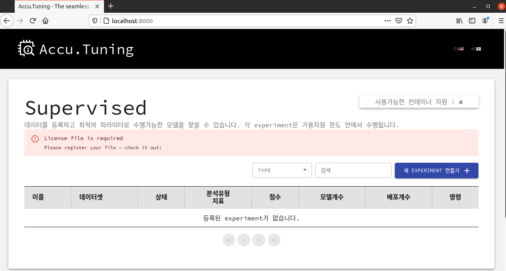
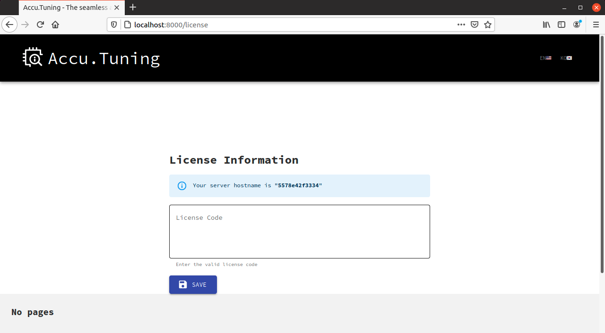

# Channel 대응 install guide 

## Server Requirement (권장)
* CPU : 8 core
* Memory : 16G 
* Disk space : 40G 이상 
* OS : docker를 구동할 수 있는 linux (ubuntu 최신버전 추천)
* pre-install : docker, docker-compose 

## 제공
### 제공 파일 
* docker-compose.yml 
* image dump file(총 3개)
  * accutuning.tar
  * modeler.tar
  * labeler.tar

### 기타 제공
* Install Guide : 지금 보고 있는 문서로 md파일의 링크 제공
* license key : 문자열 형태로 제공 

## 작업 순서 

### 1. docker와 docker-compose가 설치되어 있는지 확인합니다. 
* docker -v, docker-compose -v 명령어를 실행합니다. 
    ```shell
    docker -v
    docker-compose -v
    ```
    
* 설치되어 있을 경우 아래 그림처럼 docker와 docker-compose의 버전을 확인할 수 있습니다. 
    

* 이 문서에서는 docker와 docker-compose 설치는 다루고 있지 않습니다. 

### 2. accutuning 작업 디렉토리에 제공받은 파일을 넣습니다. 
* home 디렉토리 하위에 accutuning 디렉토리를 만들고 그 곳에 제공받은 파일을 넣습니다. 
* 참고로 파일 위치는 어디든 상관은 없으며, 이 가이드에서는 ~/accutuning 폴더를 사용할 예정입니다. 
* 해당 파티션에 50G 이상의 Free space가 필요합니다.

    


### 3. docker image를 불러옵니다. 
* 제공받은 파일 중 tar 파일을 각각의 docker image로 불러옵니다. 
    ```shell
    docker load -i accutuning.tar
    docker load -i modeler.tar
    docker load -i labeler.tar
    ```
* 잘 load 되었나 확인합니다. 
    ```shell
    docker images
    ```

    
### 4. docker-compose로 구동합니다. 
* docker-compose up -d 로 컨테이너를 구동합니다. 
* 반드시 docker-compose.yml이 있는 폴더에서 실행하셔야 합니다. 
    ```shell
    docker-compose up -d
    ```

### 5. license key를 요청합니다. 
* browser를 여시고, http://< YOUR-IP-ADDRESS >:8000/ 로 접속하세요.
  * < YOUR-IP-ADDRESS > 부분에는 accutuning을 설치한 서버의 아이피를 넣으시면 됩니다. 
* 첫 화면에서 아래 그림처럼 license 파일이 없다고 나올 겁니다. 
    

* check it out 부분을 클릭하시면 아래 그림처럼 license key를 입력하는 창이 나옵니다. license 입력창 위에 파란색으로 표기된 "Your server hostname is ..." 부분을 확인하시고, 해당 hostname으로 license key를 요청해 주세요.    

### 6. licence key를 등록합니다. 

* 위 5번 항목의 창에서, 따로 전달받으신 license key를 입력하시고 SAVE 버튼을 누르세요. 
    

* 아래 이미지처럼 입력하고 저장하면 SAVE 버튼 위에 "Valid license code until YYYY-MM-DD" 형태의 메시지로, 라이센스가 유효한 날짜를 확인할 수 있습니다. 
    

* 다시 메인화면으로 이동하면 license가 없다는 메시지가 사라졌을 겁니다. 그대로 사용하시면 됩니다. 
    
### 7. 접속하셔서 사용하시면 됩니다. 

* 다시 접속시 browser를 여시고, http://<YOUR-IP-ADDRESS>:8000/ 로 접속하세요. 

## Accu.Tuning 구동 및 정지
### 구동
* accutuning을 구동합니다. 
    ```shell
    # docker-compose.yml이 있는 폴더에서 실행합니다. 
    docker-compose up -d
    ```

### 정지
* 구동된 accutuning을 정지합니다. 
    ```shell
    # docker-compose.yml이 있는 폴더에서 실행합니다. 
    docker-compose down
    ```

### 서버 구동여부 확인
* 현재 accutuning이 구동중인지 알아봅니다. 
    ```shell
    # docker-compose.yml이 있는 폴더에서 실행합니다. 
    docker-compose ps
    ```
* 아래 화면처럼 accutuning_app이 떠 있는 것을 확인하실 수 있습니다. 
    

---
