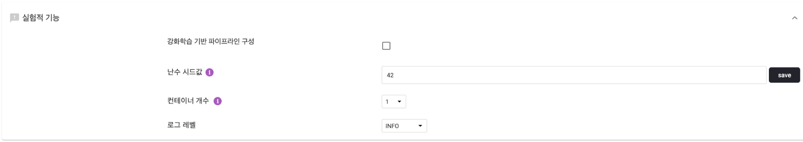

# Accu.Tuning

## 1. Accu.Tuning 개요

### 1.1. Accu.Tuning 소개 및 주요기능

Accu.Tuning은 코딩 없이도 자동으로 최적의 머신러닝 모델을 찾아주는 솔루션입니다. 데이터 분석 전문가가 아니더라도 사용할 수 있는 Accu.Tuning을 통해 다양한 알고리즘과 하이퍼파라미터를 빠르게 적용해볼 수 있습니다. 복잡한 데이터 분석에 소요되는 시간은 줄이고, 분석 성능은 높여보세요. 다양한 오픈소스 AutoML 프레임워크를 교차 활용하여 그 성능을 높이고, 다양한 산업군과 회귀·분류 등 어느 예측 목적에도 적용 가능합니다. 분석이 끝난 모델도 AccuInsight+나 Scikit-Learn 등으로 빠르게 배포하여, 쉽게 가공하고 활용할 수 있습니다.

(1) Preprocessor : 내 데이터에서 결측값 처리,
레이블링 등 복잡한 전처리 과정을 간편하게 처리하고 AutoML에 맞는
데이터셋을 자동으로 구성할 수 있습니다.

(2) Modeler : 정의한 문제에 따라 다양 오픈소스 AutoML
프레임워크를 이용하여 최적의 모델과 하이퍼파라미터를 찾고,
API를 통해 AccuInsight+ 등으로 바로 배포할 수 있습니다.

(3) Deploy : 구성된 머신러닝 모델들의 성능을 다양한 지표로 비교하여
최적의 모델을 선정하고, 설명 가능한 AI 기술을 통해
내 모델의 의미가 무엇인지 파악할 수 있도록 합니다.


## 2. 시작하기

### 2.1. 사용가능한 컨테이너 자원 확인하기

Accu.Tuning에서 수행하는 일부 작업은 도커 컨테이너에 연결하여 해당 컨테이너 내부에서 작업을 수행 합니다. 따라서, 다음 작업을 수행하기 위해서는 사용가능한 컨테이너 자원이 있는지(1개 이상) 확인하여야 합니다.

- 새 Experiment 만들기
- 탐색적 데이터 분석 수행하기
- 전처리 수행하기
- 한글데이터 컬럼 레이블링
- AutoML 실행하기
- 모델 평가 요청하기
- 배포하기
- 예측하기

본 메뉴얼에 표시가 있는 사항은 컨테이너 자원이 필요한 작업입니다.

### 2.2. 새 Experiment 만들기

Experiment란 사용자가 분석하고 싶은 하나의 과제를 의미합니다. Accu.Tuning을 시작하면 가장 먼저 하게 되는 작업은 새로운 Experiment를 생성하는 것입니다. 한 Experiment에는 하나의 Data Source를 추가할 수 있습니다. 


① 사용가능한 컨테이너 자원을 확인합니다.

② 새로운 Experiment를 생성합니다. 

③ 현재 생성되어 있는 Experiment 항목들을 볼 수 있습니다.

④ 생성된 Experiment를 시작/중지/삭제 를 할 수 있습니다.

### 2.3. 데이터 소스 등록 및 관리

사용자가 가지고 있는 데이터 파일을 Accu.Tuning으로 업로드 합니다.


① 기존에 만들었었던 소스들로 Experiment를 재생성할 수 있습니다.

② 새로운 파일을 업로드하여 소스를 생성할 수 있습니다. 새로운 소스를 생성하는 방법은 아래와 같습니다.

- 로컬 파일 불러오기 : 로컬에 있는 CSV, TSV 파일을 가지고 새 소스를 생성할 수 있습니다. (드래그 앤 드롭, 혹은 클릭해서 파일 선택)
- 최근 사용한 파일 불러오기
- Sklearn Datasets 불러오기 : scikit-learn에서 제공하는 샘플 데이터셋으로 소스를 생성할 수 있습니다. 샘플 데이터셋에 대한 자세한 사항은 [여기](https://scikit-learn.org/dev/datasets/toy_dataset.html)를 참고하세요.

③ 선택한 소스를 활용하여 Experiment를 생성합니다.

## 3. 전처리 및 데이터 분포확인(optional)

전처리(preprocess) 탭에서는 AutoML을 실행하기 전, 데이터를 변형하고 데이터 분포를 확인 할 수 있습니다. 이는 모델의 성능을 높이기 위한 사용자 선택적인(optional) 작업입니다. 


① 전처리의 각 단계별 설정과 결과물을 확인할 수 있습니다.

② 선택한 단계의 전처리된 데이터를 다운로드 할 수 있습니다.

### 3.1. 전처리 설정

③ Accu.Tuning의 전처리 옵션을 추천받을 수 있습니다. 

④ 이상치 제거, 결측치 대체 등에 대한 상세한 설정을 할 수 있습니다. ([3.2. 전처리 상세 설정](#3.2.-전처리-상세-설정) 참고)

⑤ 데이터를 샘플링하여 행의 수를 줄이거나 늘릴 수 있습니다. ([3.3. 샘플링 설정](#33-샘플링-설정) 참고)

⑥ 각 컬럼을 변수(feature)로 선택하여 모델링에 사용할지를 선택합니다.

⑦ 데이터 타입을 확인하고 변경할 수 있습니다.

⑧ 결측치 대체, 이상치 제거, 변형등을 설정합니다.

⑨ 모든 설정이 완료되면, 전처리를 실행하거나 새로운 전처리를 추가합니다.
 
### 3.2. 전처리 상세 설정


- 이상치 제거 사용 : 체크 시, 선택한 컬럼에 이상치(outlier)를 제거합니다. "이상치 제거 사용"을 체크한 컬럼에 대해서 몇 %를 이상치로 볼 것인지(이상치 기준)와, 이상치 판단 로직(이상치 판단)을 설정합니다.
- 결측치 대체 사용 : 체크 시, 선택한 컬럼에 결측치를 때 평균, 최빈값 등으로 대체합니다.
- 변수 변환 사용: 선택할 컬럼의 값들을 변환하여 사용합니다. 


### 3.3. 샘플링 설정 


- 샘플링 크기: 샘플링 후 결과 데이터의 행의 수를 설정합니다. (기본값 : 현재 행의 수) 
    - 기존 행의 수보다 작게 설정할 경우 랜덤 샘플링을 수행합니다.
    - 기존 행의 수보다 크게 설정할 경우 기존과 비슷한 분포를 가지는 가상의 데이터를 생성하여 추가합니다. (자체 딥러닝 기술 이용)
- class balancer 사용 : 체크 시 선택한 클래스의 행의 수를 기준으로 하여, 다른 클래스의 행의 수를 줄이거나 늘려 행의 수를 똑같이 맞춥니다.

### 3.4. 한글데이터 컬럼 레이블링
Accu.Tuning에서는 한글 데이터를 자동으로 레이블링하여 새로운 컬럼으로 추가하는 기능을 제공합니다(자체 자연어 처리 기법 사용). 이를 위해서는 한글데이터 컬럼이 포함된 데이터셋을 준비해야 합니다. 본 메뉴얼에서는 금융권 콜센터 상담내용을 레이블링 하는 데이터를 준비하였습니다.
 


① 레이블링 하려는 컬럼의 데이터타입이 object인지 확인합니다.

② 변형 컬럼에서 NL_LABELING을 선택합니다.

③ 설정창을 엽니다.

#### 3.4.1. Zero-Shot learning
Zero-shot learning이란 레이블링 정답을 제공하지 않은 채로 학습을 하여 AI가 스스로 레이블링 정답을 찾아내도록 하는 기법입니다. (비지도 학습)


① 레이블링 정답의 갯수를 설정합니다.

② 레이블링을 시작합니다.

아래와 같이 레이블링 결과물을 확인 할 수 있습니다.


#### 3.4.2. Few-Shot learning
Few-Shot learning이란 일부만 정답을 제공한 채로 AI가 레이블링 정답을 찾아내도록 하는 기법입니다. Zero-Shot learning 이후 사용하여 레이블링의 정확도를 높입니다. Zero-Shot learning 결과 중 사용자의 의도와 다르게 분류된 값이 있다면, 의도의 맞는 정답을 직접 제공하거나 새로운 레이블 값을 추가할 수 있습니다. 의도와 다른 모든 데이터의 정답을 제공할 필요는 없으며, 일부만 제공하면 AI가 알아서 레이블링 정답을 다시 찾아냅니다.  


① Few-Shot learning에 사용할 데이터를 선택합니다.

② 레이블링 값을 변경하거나 새로운 레이블을 추가합니다.

③ 레이블링 값을 저장합니다.

④ Few-Shot learning을 실행합니다.


#### 3.4.3. Review

레이블링 결과와 레이블링에 사용된 Text벡터를 새 feature로 추가할 수 있고, 지표와 클러스터링 시각화를 확인할 수 있습니다.


이후 전처리를 수행하면, 레이블링 결과가 새 컬럼으로 추가되었음을 확인할 수 있습니다.

### 3.5. Lag컬럼 추가하기


Lag컬럼이란, 위의 그림처럼 기존 컬럼에서 일정한 차이(Lag)를 가진 이전 혹은 이후의 행의 데이터를 가져와서 생성되는 컬럼을 의미합니다. (이전 혹은 이후의 행의 데이터가 없다면, 기존 데이터를 사용합니다.)


① Lag컬럼을 추가하려는 컬럼의 데이터타입이 float64, int64, object 중 하나인지 확인합니다.

② 변형 컬럼에서 ADD_LAGS를 선택합니다.

③ 설정창을 엽니다.


- Lag Type
    - Single : 한 lag를 기준으로 한 컬럼을 추가합니다.
    - Ranged : 특정 범위의 여러 lag를 기준으로 여러 개의 컬럼을 추가합니다.
    
- Lag Value : Lag값을 슬라이드로 입력합니다. -는 과거의 데이터 이고, +는 미래의 데이터입니다.

이후 전처리를 수행하면, lag컬럼이 새 컬럼으로 추가되었음을 확인할 수 있습니다.


### 3.6. 시계열 데이터 처리하기

Accu.Tuning에서는 시계열 데이터에 대한 여러가지 처리 기법을 제공합니다.

#### 3.6.1. datetime 컬럼 분할하기


① 분할하려는 컬럼의 데이터타입이 datetime인지 확인합니다.

② 변형 컬럼에서 POPULTAE_DATETIME_FIELD를 선택합니다.

③ 설정창을 엽니다.


format을 입력합니다. 비워두면 자동으로 변환하지만, 속도가 느려집니다.

이후 전처리를 수행하면, 시계열 컬럼이 아래와 같이 분할되었음을 확인할 수 있습니다.


#### 3.6.2. 시계열 행 보간(interpolation)하기

datetime값의 시계열 간격이 일정하지 않을 때, 변형 컬럼에서 RESAMPLE_INTERPOLATE를 선택하면 시계열 간격이 일정하도록 행을 보간합니다.


## 4. AutoML 실행


개요탭에서 AutoML에 대한 설정과 데이터 미리보기, 탐색적 데이터 분석 등을 수행한 후 ①(RUN AUTOML버튼)을 클릭하여 AutoML을 실행할 수 있습니다.

### 4.1. AutoML 옵션 설정하기

#### 4.1.1. 일반 설정
문제 유형, 지표, 타겟을 설정 합니다. 이 사항만 설정해도 AutoML을 실행할 수 있습니다.


- 문제 유형 : 해결하고자 하는 문제 유형
- 지표 : 모델을 평가할 때 쓰이는 기준(metric)
- 타깃 : 예측하고자 하는 컬럼

#### 4.1.2. 데이터 샘플링
AutoML에 사용될 데이터의 수를 조정할 수 있습니다.


#### 4.1.3. 데이터 분할


 - 리샘플링 방법 : 데이터셋에서 반복적으로 표본을 추출하여 모델을 생성하고 생성된 모델에 대한 추가적인 정보를 얻는 방법에 대한 설정입니다. 
    - holdout : 데이터셋을 train/validation/test 데이터로 분할합니다. 무작위 분할을 기본으로 하며, 특정 컬럼 값의 범위를 기준으로 분할을 할 수도 있습니다.
    - cv : 교차검증(Cross Validation)을 의미합니다. 데이터셋을 서로 다른 부분 집합(fold)로 분할하여 모델을 평가하고 여러 개의 모델의 지표를 얻습니다.

#### 4.1.4. 고급 설정


- 시간 제한 : AutoML 동작에 대한 시간 제한
- 조기 종료 : 체크 시, 특정 횟수의 모델링 시행 동안 최고 점수가 개선되지 않는 경우에 AutoML을 중지합니다.
- 각 evaluation별 최대 시간 : 한 evaluation에 사용되는 최대 시간을 의미합니다.
- 앙상블 빌더 사용 : 체크 시, 앙상블 기법을 사용합니다. 앙상블 기법이란, 여러 개의 모델의 예측결과를 종합해 최종 예측 결과를 도출하는 기법입니다. 
- estimator 선택 : 최적화 탐색에 사용할 알고리즘 목록을 선택할 수 있습니다. 개별 알고리즘에 대한 설명은 [지원하는 모델 알고리즘](./model.md) 페이지를 참고하세요.
- one-hot 인코딩 : 체크 시, experiment에서 feature로 사용되는 카테고리 혹은 Object 컬럼(텍스트 등)에 대해 one-hot 인코딩을 실시합니다.
- 분산 임계치 : 체크 시, 전처리 과정에서 분산이 일정 수준 이하 (기본값 0)인 feature들을 찾고, 이러한 예측력이 낮거나 없는 feature들을 삭제합니다.
- 스케일링 : 전처리 과정에서 선택한 방법으로 전체 feature를 스케일링하거나 표준화함으로써, 특정 모델에서 더 나은 결과를 도출할 수 있습니다.
    - standardize :각 feature값에서 평균을 뺀 후에 표준편차로 나누어 평균 0, 표준편차 1로 변환합니다.
    - minmax : 최소값과 최대값을 먼저 계산하고 이 값을 이용하여 전체 feature값들을 0~1 사이의 값으로 변경합니다.
    - normalize : 최소값이 0, 최대값이 1이도록 데이터셋을 변경합니다.
- feature 엔지니어링 : feature 선택과 차원 축소 등을 포함하며 고차원의 데이터셋에 대한 성능을 개선하기 위해 사용됩니다.
    - SelectPercentile : 점수가 높은 상위 비율의 feature만을 선택합니다.
    - SelectKBest : 점수가 높은 k개의 feature만을 선택합니다.
    - SelectFwe: family-wise 에러 비율이 낮은 feaure를 선택합니다.
    - Boruta : boruta 라이브러리를 사용하여 feaure를 선택합니다. 자세한 사항은 [여기](https://github.com/scikit-learn-contrib/boruta_py)를 참고하세요.
    - FastICA : 독립 성분 분석(Fast Independent Component Analysis)을 통해 feature의 수를 줄입니다.
    - FeatureAgglomeration : feature들을 합쳐서 feature의 수를 줄입니다.
    - Polynomial : 교차곱(interaction)을 통해 feature의 수를 늘립니다.
    - PCA : 주성분 분석(Principal Component Analysis)으로 feature를 줄입니다.
    - Nystroem : Kernel approximation을 통해 데이터셋을 변형합니다.
    
#### 4.1.5. 실험적 기능

실험적 기능은 아직 안전하게 동작하지 않지만, 일부 다음과 같은 유용한 기능들을 사용하실 수 있습니다.



- 강화학습기반 파이프라인 구성 (베타) : 강화학습을 이용해서 파이프라인을 구성한 후, 하이퍼파라미터를 탐색합니다. 이 기능은 충분히 검증되지는 않았습니다.
- 난수시드값 설정 : 난수값은 실험에서 사용되는 무작위값에 대한 시드값을 조정해서, 다른 결과를 만들어내거나 혹은 같은 결과를 만들어낼 수 있습니다.
- 컨테이너 개수 : 모델링을 복수개의 컨테이너를 띄워서 수행합니다. 컨테이너 개수를 늘릴 경우 고급설정에서 할당한 알고리즘들을 컨테이너 개수만큼 나누어서 동시에 수행하기 때문에, 빠른 시간에 좋은 결과를 얻어낼 수 있습니다. (단 사용가능한 컨테이너 개수가 설정한 컨테이너 개수 이상 남아있어야 합니다.)
- 로그레벨 : 실험 수행시에 기록되는 로그의 수준을 조정합니다. 로그레벨이 낮을 수록 성능에 영향을 끼칠 수 있습니다.


### 4.2. 데이터 타입 조정 / 분포 확인 확인하기

#### 4.2.1. 데이터 미리보기
데이터셋 상위 9개의 행을 미리 볼 수 있습니다.  


#### 4.2.2. 데이터 컬럼
데이터 컬럼 테이블을 통해 타입을 조정하고 분포를 확인할 수 있습니다.


① 각 컬럼을 변수(feature)로 선택하여 모델링에 사용할지를 선택합니다.

② 데이터 타입을 확인하고 변경할 수 있습니다.


### 4.3. 탐색적 데이터 분석 수행하기


① 데이터 셋에 대한 플롯을 생성할 수 있습니다. 기본적으로 상관행렬과 평행좌표가 생성됩니다.

② 생성을 원하는 플롯 종류를 선택합니다.

- 상관행렬 : 변수 간의 상관계수를 보여줍니다. 각 셀은 두 변수 간의 상관관계를 나타냅니다. 데이터를 요약하는 상관 행렬은 더 고도의 분석을 실시하기 위한 입력이나 진단 방법으로 활용됩니다.
- 평행좌표 : 데이터셋의 각 행을 각 차원을 나타내는 평행축을 가로지르는 폴리라인으로 나타냅니다. Interactive한 도표이기에 축을 따라 선을 드래그하여 원하는 영역을 필터링할 수 있습니다.
- 페어 플롯(Pairplot) : 데이터셋의 쌍별 관계를 나타냅니다. Pairplot은 개별 변수의 분포와 두 변수 간의 상관관계를 함께 볼 수 있도록 하며, 변수나 차원 간의 관계나 패턴을 이해하는데 사용됩니다.
- 변수 분석: 각 변수(feature) 혹은 타깃 값에 대한 분포를 나타냅니다.
- 평행좌표 : 데이터셋의 각 행을 각 차원을 나타내는 평행축을 가로지르는 폴리라인으로 나타냅니다. Interactive한 도표이기에 축을 따라 선을 드래그하여 원하는 영역을 필터링할 수 있습니다.

## 5. AutoML 결과 확인

### 5.1. 실시간 점수/알고리즘 확인하기

Accu.Tuning 모델의 점수와 변수의 중요도 등을 볼 수 있습니다.


① 알고리즘 점수를 미리보고 실시간 추세를 확인할 수 있습니다.

② 모델을 생성할때 어떠한 알고리즘이 사용되었는지 확인할 수 있습니다.

③ 각 컨테이너별로 현재 시도하고 있는 알고리즘에 대한 정보입니다. 알고리즘 이름(경과시간 / 개별타임아웃 시간) 형태로 표시됩니다.

④ train/valid/test 데이터의 정보를 확인하고 다운로드할 수 있습니다. 

⑤ 모델에 대한 평가를 확인할 수 있습니다. ([5.2. 모델 평가 확인하기](#52-모델-평가-확인하기) 참고)

⑥ 모델에 대한 다양한 정보를 확인할 수 있습니다.([5.3. 모델 정보 확인하기](#53-모델-정보-확인하기) 참고)

⑦ 최적의 모델을 선택하여 배포합니다. ([5.4. 모델 배포하기](#54-모델-배포하기) 참고)

⑧ AutoML을 종료합니다.

### 5.2. 모델 평가 확인하기
선택한 모델이 대한 다양한 정보를 확인할 수 있습니다.

- 지표: AutoML 실행 전 기본적으로 설정한 지표 외에 해당 모델을 평가한 다양한 지표를 확인 할 수 있습니다.


- 플롯: 모델을 평가하는 다양한 플롯을 생성할 수 있습니다. 기본값으로 Permutation Feature Importance 가 생성됩니다. 


 ① 생성을 원하는 플롯 종류를 선택합니다.
 
 ② 선택한 플롯을 다시 그립니다. 
 
### 5.3. 모델 정보 확인하기
모델이 생성되는 파이프라인 정보를 나타냅니다. 전처리 전과정과 하이퍼파리미터 정보를 확인할 수 있습니다.


### 5.4. 모델 배포하기
사용자가 원하는 모델을 찾아 배포합니다. 일반적으로 최상단에 위치한 지표가 가장 높은 모델을 선택하는 것이 좋습니다. 배포탭에서 배포가 완료된 모델 정보를 확인할 수 있습니다. 

## 6. 배포

### 6.1. 배포모델을 비교/관리하기

여려 개의 배포모델을 비교하고 관리할 수 있습니다.


① 배포된 모델 중 상세 정보를 표시할 모델을 선택합니다.

② 배포된 모델을 삭제합니다.


### 6.2. 배포 모델 다운로드 후 사용하기


① 배포된 Binary 파일을 다운로드 합니다.

② 소스코드 복사후 '## YOUR SOURCE FILE ##'에 Binary 파일의 경로를 , '## TARGET VARIABLE ##'에 타깃 컬럼의 이름을 입력합니다.

- 일부 전처리는 accutuning_helpers 패키지를 필요로 합니다. 아래 명령어를 통해 accutuning_helpers 패키지를 설치할 수 있습니다.
```
pip install \
--trusted-host github.com \
--trusted-host codeload.github.com \
https://github.com/AIIP-DEV/accutuning_helpers/archive/v1.0.21.zip
```

### 6.3. 배포 모델 파이프라인 확인하기

배포 모델에 대한 파이프라인 정보를 확인할 수 있습니다. 


### 6.4. 예측 수행하기


#### 6.4.1. API를 통한 예측 수행

① 기재된 URL, Method, Input을 활용하여 API를 통해 예측을 수행할 수 있습니다.

#### 6.4.2. 화면에서 간단한 예측 수행

② 각 컬럼에 해당하는 input값을 입력합니다. 기본값으로 최빈값이 입력됩니다.

③ 예측을 수행합니다.

④ 예측 결과와 함께 예측에 대한 설명을 확인합니다.

⑤ 과거 예측 이력을 조회할 수 있습니다.

